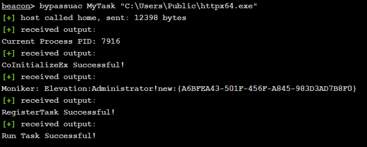

# BOF-BypassUAC
一个BypassUAC的BOF用来bypass Windows Defender on Win10/11。

## 介绍
这个 BOF 旨在提供一个更具 OPSEC 安全性的 bypassUAC 功能版本，以对抗 Windows Defender。

测试版本：
* Windows Defender 1.419.338.0 (更新于 04/10/2024)

## 自编译
1. 克隆仓库。
2. 在 Visual Studio 中打开BOF-BypassUAC.sln。
3. 构建项目x64 或 x86。
4. 将文件对象放置在与 BypassUAC.cna 相同的文件夹中。

## 使用方法
1. 将 BypassUAC.cna 脚本导入 Cobalt Strike。
2. 使用命令：bypassuac <Task name> <Commandline>

例如:
```
beacon> bypassuac MyTask "C:\Users\Public\httpx64.exe
```
结果:



## 参考
https://www.zcgonvh.com/post/Advanced_Windows_Task_Scheduler_Playbook-Part.2_from_COM_to_UAC_bypass_and_get_SYSTEM_dirtectly.html

https://github.com/BambiZombie/bypass_uac_bof

## 免责声明
我对您使用这段糟糕代码可能犯下的任何反人类罪行或引发的核战争不承担任何责任。